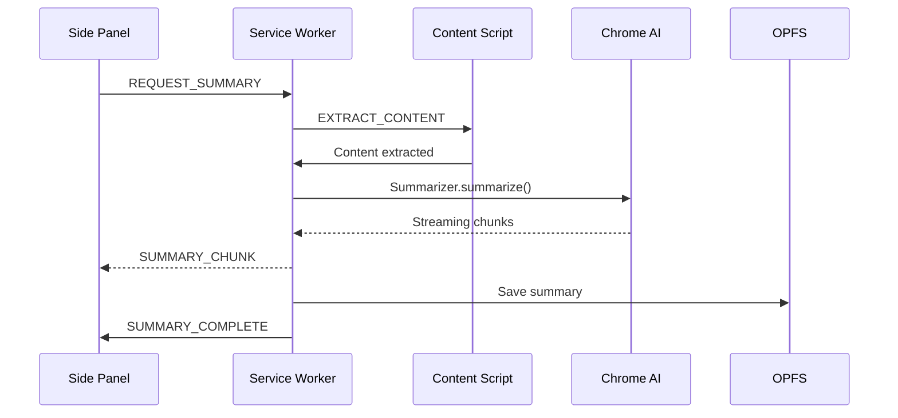

# NutShell Technical Documentation

**Architecture, Implementation, and Developer Guide**

---

## Table of Contents

1. [Architecture Overview](#architecture-overview)
2. [Chrome AI APIs Used](#chrome-ai-apis-used)
3. [File Structure](#file-structure)
4. [Core Systems](#core-systems)
5. [Data Flow](#data-flow)
6. [Storage Architecture](#storage-architecture)
7. [Performance Optimizations](#performance-optimizations)
8. [Security & Privacy](#security--privacy)
9. [Developer Setup](#developer-setup)
10. [Testing Guide](#testing-guide)
11. [Troubleshooting](#troubleshooting)

---

## Architecture Overview

### High-Level Architecture

```
┌─────────────────────────────────────────────────────────────┐
│                    Chrome Browser (MV3)                      │
├─────────────────────────────────────────────────────────────┤
│                                                               │
│  ┌──────────────┐      ┌──────────────┐     ┌────────────┐ │
│  │   Sidebar    │◄─────┤   Service    │────►│  Content   │ │
│  │  (Side Panel)│      │   Worker     │     │   Scripts  │ │
│  │              │      │ (Background) │     │            │ │
│  │  - Home View │      │              │     │ - Extractor│ │
│  │  - Chat View │      │ - Session Mgr│     │ - SERP Det.│ │
│  │  - History   │      │ - SERP Analy.│     │            │ │
│  │  - Settings  │      │ - Workers    │     │            │ │
│  └──────────────┘      └──────────────┘     └────────────┘ │
│         │                      │                    │        │
│         │                      │                    │        │
│         ▼                      ▼                    ▼        │
│  ┌─────────────────────────────────────────────────────────┐│
│  │            Chrome Built-in AI (Gemini Nano)             ││
│  │  ┌──────────────┐  ┌──────────────┐  ┌──────────────┐  ││
│  │  │  Prompt API  │  │ Summarizer   │  │  Language    │  ││
│  │  │ (Q&A, Chat)  │  │     API      │  │  Detector    │  ││
│  │  └──────────────┘  └──────────────┘  └──────────────┘  ││
│  └─────────────────────────────────────────────────────────┘│
│         │                      │                    │        │
│         ▼                      ▼                    ▼        │
│  ┌─────────────────────────────────────────────────────────┐│
│  │           Origin Private File System (OPFS)             ││
│  │  - Sessions (per tab)   - Registry   - Analytics       ││
│  │  - Chat History         - Settings   - Cache           ││
│  └─────────────────────────────────────────────────────────┘│
└─────────────────────────────────────────────────────────────┘
```

### Component Communication



---

## Chrome AI APIs Used

### 1. Prompt API (LanguageModel)

**Purpose:** Conversational reasoning, Q&A, synthesis, session recaps

**Usage Patterns:**

```javascript
// Initialize session
const session = await ai.languageModel.create({
  temperature: 0.7,
  topK: 40,
  systemPrompt: "You are a helpful research assistant..."
});

// Single-turn prompt
const response = await session.prompt("What is X?");

// Streaming response
const stream = await session.promptStreaming("Explain Y");
for await (const chunk of stream) {
  console.log(chunk);
}

// Destroy when done
session.destroy();
```

**Where We Use It:**
- `qna-worker.js`: Single-page Q&A
- `multi-page-qna-worker.js`: Cross-tab chat
- `sidebar.js`: Session recaps, navigation summaries
- `research-mode.js`: Comprehensive research answers

**Key Features:**
- System prompts for behavior tuning
- Streaming for real-time UX
- Context window: ~8K tokens
- Temperature control for creativity vs accuracy

### 2. Summarizer API

**Purpose:** Fast, streaming page summaries

**Usage Patterns:**

```javascript
// Create summarizer
const summarizer = await ai.summarizer.create({
  type: 'tl;dr',  // or 'key-points', 'headline'
  format: 'markdown',
  length: 'medium'  // short, medium, long
});

// Check if content is too long
const canSummarize = await summarizer.canSummarize(text);

// Streaming summary
const stream = await summarizer.summarizeStreaming(text);
for await (const chunk of stream) {
  displayChunk(chunk);
}

// Cleanup
summarizer.destroy();
```

**Where We Use It:**
- `summarizer-worker.js`: Main page summarization
- `serp-analyzer.js`: SERP result condensation
- `research-mode.js`: Source summarization before synthesis

**Optimizations:**
- Chunking for large pages (max ~10K tokens)
- Progressive tile-based summarization
- Concurrent summarization of multiple pages

### 3. Language Detector & Translator

**Purpose:** Multi-language support (optional)

**Usage:**

```javascript
// Detect language
const detector = await translation.createDetector();
const results = await detector.detect(text);
console.log(results[0].detectedLanguage); // 'en', 'es', etc.

// Translate
const translator = await translation.createTranslator({
  sourceLanguage: 'es',
  targetLanguage: 'en'
});
const translated = await translator.translate(text);
```

**Where We Use It:**
- Optional feature for non-English content
- Auto-detect → Translate → Summarize pipeline

---

## File Structure

```
NutShell-MVP/
├── manifest.json              # Extension manifest (MV3)
├── README.md                  # User-facing documentation
├── TECHNICAL.md              # This file
├── USER-GUIDE.md             # Feature walkthrough
│
├── background/               # Service Worker (background processing)
│   ├── service-worker.js     # Main orchestrator
│   ├── session-manager.js    # Session CRUD, registry management
│   └── serp-analyzer.js      # Google SERP detection & analysis
│
├── sidebar/                  # Side Panel UI
│   ├── sidebar.html          # Main UI structure
│   ├── sidebar.css           # Material Design styling
│   ├── sidebar.js            # Controller, state management
│   └── views/                # View components
│       ├── chat-view.js      # Chat interface
│       ├── history-view.js   # Research history
│       └── serp-view.js      # SERP analysis results
│
├── content/                  # Content Scripts (DOM interaction)
│   ├── content-script.js     # Main content script
│   └── google-serp-extractor.js  # Google SERP parsing
│
├── workers/                  # Web Workers (AI processing)
│   ├── summarizer-worker.js  # Page summarization
│   ├── qna-worker.js         # Single-page Q&A
│   └── multi-page-qna-worker.js  # Cross-tab chat
│
├── lib/                      # Shared libraries
│   ├── ai.js                 # Chrome AI API wrappers
│   ├── storage.js            # OPFS utilities
│   ├── retrieval.js          # BM25 retrieval for RAG
│   ├── multi-page-bm25.js    # Cross-tab retrieval
│   └── utils.js              # General utilities
│
├── research-mode.html        # Research Mode new tab page
├── research-mode.js          # Research Mode logic
├── research-mode.css         # Research Mode styling
│
├── cache.html                # Cache viewer (dev tool)
├── cache-viewer.js           # OPFS inspector
│
└── assets/                   # Icons, images
    └── logo.png
```

---

## Core Systems

### 1. Session Management

**Location:** `background/session-manager.js`

**Responsibilities:**
- Create/retrieve/update sessions per tab
- Maintain registry for fast lookups
- Persist to OPFS
- Handle tab lifecycle events

**Data Structure:**

```javascript
// Session object
{
  id: "session_1234567890",
  tabId: 123,
  url: "https://example.com",
  title: "Example Page",
  timestamp: 1234567890000,
  lastAccessed: 1234567890000,
  
  // Content
  summary: {
    sections: [...],
    tldr: "...",
    timestamp: 1234567890000
  },
  extractedContent: {
    text: "...",
    sections: [...],
    metadata: {...}
  },
  
  // Chat
  chatHistory: [
    { role: 'user', content: '...', timestamp: ... },
    { role: 'assistant', content: '...', timestamp: ... }
  ],
  
  // Navigation
  navigationHistory: [
    { url: '...', title: '...', timestamp: ... }
  ],
  
  // Metadata
  wordCount: 1234,
  readingTime: 5,
  language: 'en',
  tags: ['research', 'ai']
}
```

**Registry Structure:**

```javascript
// registry.json (OPFS)
{
  sessions: {
    "session_1234567890": {
      id: "session_1234567890",
      tabId: 123,
      url: "https://example.com",
      title: "...",
      timestamp: ...,
      lastAccessed: ...
    }
  },
  tabToSession: {
    "123": "session_1234567890"
  },
  urlToSessions: {
    "https://example.com": ["session_1234567890", "session_9876543210"]
  }
}
```

**Key Methods:**

```javascript
// Create or get existing session
const session = await SessionManager.getOrCreateSession(tabId, url, title);

// Update session
await SessionManager.updateSession(sessionId, { summary: {...} });

// Find by tab
const session = await SessionManager.findSessionByTabId(tabId);

// Find by URL (for history)
const sessions = await SessionManager.findSessionsByURL(url);

// Delete session
await SessionManager.deleteSession(sessionId);
```

### 2. SERP Analysis System

**Location:** `background/serp-analyzer.js`

**Flow:**

1. **Detection** (Content Script):
   ```javascript
   // google-serp-extractor.js
   if (isSerpPage) {
     chrome.runtime.sendMessage({ type: 'SERP_DETECTED', results: [...] });
   }
   ```

2. **User Initiates Analysis** (Sidebar):
   ```javascript
   // sidebar.js
   chrome.runtime.sendMessage({ 
     type: 'ANALYZE_SERP', 
     topN: 5,
     query: "..."
   });
   ```

3. **Background Processing** (Service Worker):
   ```javascript
   // serp-analyzer.js
   async function analyzeSerpResults(results, topN) {
     // 1. Open tabs in background
     const tabs = await Promise.all(
       results.slice(0, topN).map(r => chrome.tabs.create({ url: r.url, active: false }))
     );
     
     // 2. Wait for content extraction
     const contents = await Promise.all(
       tabs.map(tab => extractContent(tab.id))
     );
     
     // 3. Summarize each (parallel)
     const summaries = await Promise.all(
       contents.map(content => summarize(content))
     );
     
     // 4. Synthesize comparison
     const comparison = await synthesize(summaries, query);
     
     // 5. Return results
     return {
       results: summaries,
       comparison: comparison,
       tabIds: tabs.map(t => t.id)
     };
   }
   ```

4. **Display Results** (Sidebar):
   ```javascript
   // views/serp-view.js
   function displayAnalysis(results) {
     results.forEach(result => {
       createResultCard(result);  // Title, summary, relevance score
     });
     displayComparison(results.comparison);
   }
   ```

### 3. Cross-Tab Chat System

**Location:** `workers/multi-page-qna-worker.js`

**Architecture:**

```javascript
// Unified context from multiple tabs
const context = {
  pages: [
    {
      url: "https://site1.com",
      title: "...",
      content: "...",
      summary: "...",
      sections: [...]
    },
    {
      url: "https://site2.com",
      title: "...",
      content: "...",
      summary: "...",
      sections: [...]
    }
  ],
  query: "User's question"
};

// BM25 retrieval across all pages
const relevantChunks = retrieveRelevantChunks(context.pages, query);

// Build prompt with multi-page context
const systemPrompt = `You are analyzing multiple webpages. 
Answer questions by synthesizing information across all sources.
Always cite which page each fact comes from using [domain.com] format.`;

const prompt = `
SOURCES:
${relevantChunks.map((chunk, i) => `
[${i + 1}] ${chunk.url}
${chunk.text}
`).join('\n')}

QUESTION: ${query}

INSTRUCTIONS:
- Synthesize information from ALL relevant sources
- Cite sources inline: [domain.com]
- If sources disagree, mention both perspectives
- If no source has the answer, say so

ANSWER:
`;
```

**BM25 Retrieval:**

```javascript
// lib/multi-page-bm25.js
class MultiPageBM25 {
  constructor(pages) {
    this.pages = pages;
    this.index = this.buildIndex();
  }
  
  buildIndex() {
    // Tokenize all pages
    const docs = this.pages.flatMap(page => 
      page.sections.map(section => ({
        pageUrl: page.url,
        text: section.content,
        tokens: tokenize(section.content)
      }))
    );
    
    // Build BM25 index
    return new BM25Index(docs);
  }
  
  retrieve(query, topK = 10) {
    const scores = this.index.score(query);
    return scores.slice(0, topK);
  }
}
```

### 4. Research Mode System

**Location:** `research-mode.js`

**Complete Flow:**

```javascript
async function handleResearchQuery(query) {
  // 1. Google search
  updateStatus("Searching Google...");
  const searchUrl = `https://www.google.com/search?q=${encodeURIComponent(query)}`;
  const searchTab = await chrome.tabs.create({ url: searchUrl, active: false });
  
  // 2. Extract SERP results
  await waitForPageLoad(searchTab.id);
  const results = await extractSerpResults(searchTab.id);
  updateStatus(`Found ${results.length} results`);
  
  // 3. Open top N results
  updateStatus("Opening sources...");
  const sourceTabs = await Promise.all(
    results.slice(0, topN).map(r => 
      chrome.tabs.create({ url: r.url, active: false })
    )
  );
  
  // 4. Extract content from each
  updateStatus("Analyzing pages...");
  const contents = [];
  for (let i = 0; i < sourceTabs.length; i++) {
    updateProgress(i, sourceTabs.length);
    const content = await extractContent(sourceTabs[i].id);
    contents.push(content);
  }
  
  // 5. Summarize each page
  updateStatus("Generating summaries...");
  const summaries = await Promise.all(
    contents.map(async (content, i) => {
      const summary = await summarize(content.text);
      return {
        url: sourceTabs[i].url,
        title: content.title,
        summary: summary,
        relevance: calculateRelevance(summary, query)
      };
    })
  );
  
  // 6. Synthesize comprehensive answer
  updateStatus("Synthesizing answer...");
  const answer = await synthesizeAnswer(summaries, query);
  
  // 7. Display results
  displayAnswer(answer, summaries);
  
  // 8. Save to history
  await saveResearchSession({
    query: query,
    sources: summaries,
    answer: answer,
    timestamp: Date.now()
  });
  
  // 9. Close background tabs
  await Promise.all(sourceTabs.map(tab => chrome.tabs.remove(tab.id)));
  await chrome.tabs.remove(searchTab.id);
}
```

**Resume Flow:**

```javascript
// Check for interrupted research on new tab
async function checkForInterruptedResearch() {
  const interrupted = await storage.get('interrupted_research');
  if (interrupted && Date.now() - interrupted.timestamp < 3600000) {
    showResumePrompt(interrupted);
  }
}

function showResumePrompt(research) {
  display(`Resume research: "${research.query}"?`);
  // If yes → Continue from last step
  // If no → Clear interrupted state
}
```

### 5. Session Recap System

**Location:** `sidebar/sidebar.js` (`generateSessionOverview()`)

**When Triggered:**
- User returns to tab after 15+ minutes
- User manually requests recap
- Research session completes

**Implementation:**

```javascript
async function generateSessionOverview(session) {
  // Get recent messages (last 4)
  const recentMessages = session.chatHistory.slice(-4);
  
  // Build conversation text
  const conversationText = recentMessages
    .map(m => `${m.role}: ${m.content}`)
    .join('\n\n');
  
  // AI prompt (concise)
  const systemPrompt = `You are a helpful session recap assistant. 
  Create a brief "at a glance" summary of this chat session.
  
  GOAL: Quickly remind the user what they wanted and what was discussed recently.
  
  RULES:
  - Write ONLY 1-2 short sentences (max 30 words total)
  - Focus on: What the user wanted + what was discussed in the last 1-2 messages
  - Be extremely concise - this is a quick glance, not a detailed recap
  - Use plain conversational language
  - NO markdown formatting, just plain text
  - Example: "You asked about X and learned that Y."`;
  
  const session = await ai.languageModel.create({
    temperature: 0.3,
    topK: 3,
    systemPrompt: systemPrompt
  });
  
  const recap = await session.prompt(
    `Create a brief at-a-glance recap (1-2 sentences max) for this conversation. 
    Focus on what the user wanted and the last couple of messages:\n\n
    ${conversationText}\n\nRecap:`
  );
  
  session.destroy();
  return recap;
}
```

---

## Data Flow

### Summarization Flow

```
User visits page
      ↓
Content Script extracts DOM
      ↓
Sends to Service Worker
      ↓
Service Worker starts Summarizer Worker
      ↓
Worker chunks content (if large)
      ↓
Chrome Summarizer API (streaming)
      ↓
Chunks sent back to Service Worker
      ↓
Service Worker forwards to Sidebar
      ↓
Sidebar displays streaming summary
      ↓
Final summary saved to OPFS
```

### Q&A Flow

```
User asks question in Sidebar
      ↓
Sidebar sends to Service Worker
      ↓
Service Worker loads session from OPFS
      ↓
Service Worker starts QnA Worker
      ↓
Worker performs BM25 retrieval
      ↓
Worker builds prompt with relevant chunks
      ↓
Chrome Prompt API (streaming)
      ↓
Answer chunks sent back
      ↓
Sidebar displays streaming answer
      ↓
Final answer + question saved to session
```

### Cross-Tab Chat Flow

```
User initiates "Dive Deeper"
      ↓
Sidebar requests multi-page chat
      ↓
Service Worker loads all analyzed pages
      ↓
Starts Multi-Page QnA Worker
      ↓
Worker builds unified index (BM25)
      ↓
User asks question
      ↓
Worker retrieves from all pages
      ↓
Worker builds prompt with multi-source context
      ↓
Chrome Prompt API generates answer
      ↓
Answer with source citations displayed
      ↓
Chat history saved to special multi-page session
```

---

## Storage Architecture

### OPFS Structure

```
/nutshell-opfs/
├── registry.json              # Fast session lookup index
├── sessions/
│   ├── session_1234567890.json
│   ├── session_9876543210.json
│   └── ...
├── research-history/
│   ├── research_1234567890.json
│   └── ...
├── settings.json              # User preferences
└── analytics.json             # Usage stats (optional, local only)
```

### OPFS Utilities

**Location:** `lib/storage.js`

```javascript
class OPFSStorage {
  async init() {
    const root = await navigator.storage.getDirectory();
    this.root = root;
  }
  
  async writeJSON(path, data) {
    const file = await this.root.getFileHandle(path, { create: true });
    const writable = await file.createWritable();
    await writable.write(JSON.stringify(data, null, 2));
    await writable.close();
  }
  
  async readJSON(path) {
    try {
      const file = await this.root.getFileHandle(path);
      const fileData = await file.getFile();
      const text = await fileData.text();
      return JSON.parse(text);
    } catch (e) {
      return null;
    }
  }
  
  async delete(path) {
    await this.root.removeEntry(path);
  }
  
  async list(directory = '') {
    const dir = directory 
      ? await this.root.getDirectoryHandle(directory)
      : this.root;
    const entries = [];
    for await (const entry of dir.values()) {
      entries.push(entry.name);
    }
    return entries;
  }
}
```

### Session Persistence Strategy

**Write Strategy:**
- Debounced writes (300ms) to avoid excessive I/O
- Write-through cache in memory
- Background sync for non-critical updates

**Read Strategy:**
- In-memory cache with TTL (5 minutes)
- Cache invalidation on updates
- Registry-based fast lookups (avoid scanning all files)

**Example:**

```javascript
class SessionCache {
  constructor() {
    this.cache = new Map();
    this.ttl = 5 * 60 * 1000; // 5 minutes
  }
  
  async get(sessionId) {
    // Check cache
    const cached = this.cache.get(sessionId);
    if (cached && Date.now() - cached.timestamp < this.ttl) {
      return cached.data;
    }
    
    // Load from OPFS
    const session = await storage.readJSON(`sessions/${sessionId}.json`);
    
    // Update cache
    this.cache.set(sessionId, {
      data: session,
      timestamp: Date.now()
    });
    
    return session;
  }
  
  async set(sessionId, data) {
    // Update cache
    this.cache.set(sessionId, {
      data: data,
      timestamp: Date.now()
    });
    
    // Debounced write to OPFS
    this.scheduleWrite(sessionId, data);
  }
  
  scheduleWrite(sessionId, data) {
    clearTimeout(this.writeTimers?.[sessionId]);
    this.writeTimers = this.writeTimers || {};
    this.writeTimers[sessionId] = setTimeout(async () => {
      await storage.writeJSON(`sessions/${sessionId}.json`, data);
    }, 300);
  }
}
```

---

## Performance Optimizations

### 1. Chunking Large Content

```javascript
// For pages > 10K tokens
function chunkContent(text, maxChunkSize = 3000) {
  const sections = splitIntoSections(text);
  const chunks = [];
  let currentChunk = '';
  
  for (const section of sections) {
    if (currentChunk.length + section.length > maxChunkSize) {
      chunks.push(currentChunk);
      currentChunk = section;
    } else {
      currentChunk += '\n\n' + section;
    }
  }
  
  if (currentChunk) chunks.push(currentChunk);
  return chunks;
}

// Summarize in tiles, then summarize summaries
async function tiledSummarization(chunks) {
  const summaries = await Promise.all(
    chunks.map(chunk => summarizer.summarize(chunk))
  );
  
  if (summaries.length > 1) {
    const combined = summaries.join('\n\n');
    return await summarizer.summarize(combined);
  }
  
  return summaries[0];
}
```

### 2. Parallel Processing

```javascript
// Summarize multiple SERP results in parallel
async function parallelSummarization(pages) {
  // Limit concurrency to avoid overwhelming device
  const MAX_CONCURRENT = 3;
  const results = [];
  
  for (let i = 0; i < pages.length; i += MAX_CONCURRENT) {
    const batch = pages.slice(i, i + MAX_CONCURRENT);
    const batchResults = await Promise.all(
      batch.map(page => summarize(page.content))
    );
    results.push(...batchResults);
    
    // Optional: Report progress
    reportProgress(i + batch.length, pages.length);
  }
  
  return results;
}
```

### 3. Progressive Loading

```javascript
// Show quick summary first, detailed sections later
async function progressiveSummarization(text) {
  // 1. Quick TL;DR (first 2000 chars)
  const preview = text.slice(0, 2000);
  const tldr = await summarizer.summarize(preview, { length: 'short' });
  displayTLDR(tldr);
  
  // 2. Full summary (background)
  const fullSummary = await summarizer.summarize(text, { length: 'medium' });
  displayFullSummary(fullSummary);
  
  // 3. Section-by-section details (lowest priority)
  const sections = extractSections(text);
  for (const section of sections) {
    const sectionSummary = await summarizer.summarize(section.content);
    displaySection(section.title, sectionSummary);
  }
}
```

### 4. Streaming for Responsiveness

```javascript
// Stream summary as it generates
async function streamingSummary(text) {
  const stream = await summarizer.summarizeStreaming(text);
  let accumulated = '';
  
  for await (const chunk of stream) {
    accumulated += chunk;
    updateDisplay(accumulated);  // Update UI in real-time
  }
  
  return accumulated;
}
```

### 5. Resource Management

```javascript
// Cleanup AI sessions when done
class AISessionPool {
  constructor() {
    this.sessions = new Map();
  }
  
  async getSession(type, options) {
    const key = `${type}_${JSON.stringify(options)}`;
    
    if (!this.sessions.has(key)) {
      const session = await this.createSession(type, options);
      this.sessions.set(key, { session, lastUsed: Date.now() });
    }
    
    this.sessions.get(key).lastUsed = Date.now();
    return this.sessions.get(key).session;
  }
  
  async cleanup() {
    const now = Date.now();
    const TTL = 5 * 60 * 1000; // 5 minutes
    
    for (const [key, { session, lastUsed }] of this.sessions) {
      if (now - lastUsed > TTL) {
        session.destroy();
        this.sessions.delete(key);
      }
    }
  }
}
```

---

## Security & Privacy

### Privacy Guarantees

**1. No Network Calls for AI:**
```javascript
// All AI processing is local
const session = await ai.languageModel.create();  // Uses Gemini Nano on device
// ❌ No fetch() calls to external APIs
// ❌ No XMLHttpRequest to cloud services
// ✅ All inference on-device
```

**2. OPFS Isolation:**
```javascript
// OPFS is origin-private (cannot be accessed by other extensions/sites)
const root = await navigator.storage.getDirectory();
// ✅ Isolated per extension
// ✅ Not accessible to other origins
// ✅ Not synced to cloud
```

**3. No Telemetry:**
```javascript
// We don't track anything
// ❌ No Google Analytics
// ❌ No error reporting to external services
// ❌ No usage statistics sent anywhere
// ✅ Optional local analytics (never leaves device)
```

### Security Measures

**1. Content Security Policy:**
```json
// manifest.json
{
  "content_security_policy": {
    "extension_pages": "script-src 'self'; object-src 'self'"
  }
}
```

**2. Minimal Permissions:**
```json
// manifest.json
{
  "permissions": [
    "sidePanel",
    "storage",
    "tabs",
    "webNavigation"
  ],
  "host_permissions": [
    "<all_urls>"  // Required for content extraction only
  ]
}
```

**3. Input Sanitization:**
```javascript
// Sanitize user input before processing
function sanitizeInput(text) {
  return text
    .replace(/<script[^>]*>.*?<\/script>/gi, '')
    .replace(/<[^>]+>/g, '')
    .trim()
    .slice(0, 10000); // Max length
}
```

**4. XSS Prevention:**
```javascript
// Use textContent, not innerHTML
element.textContent = userInput;  // ✅ Safe
element.innerHTML = userInput;    // ❌ Dangerous
```

---

## Developer Setup

### Prerequisites

- Chrome Canary/Dev 138+
- Git
- Basic understanding of Chrome Extensions

### Setup Steps

1. **Clone Repository:**
   ```bash
   git clone https://github.com/YOUR_USERNAME/nutshell-extension.git
   cd nutshell-extension/NutShell-MVP
   ```

2. **Enable Chrome AI:**
   - Open `chrome://flags`
   - Enable "Prompt API for Gemini Nano"
   - Enable "Summarization API for Gemini Nano"
   - Enable "Optimization Guide On Device Model" with BypassPerfRequirement
   - Relaunch Chrome
   - Wait 5-10 minutes for model download

3. **Load Extension:**
   - Open `chrome://extensions/`
   - Enable Developer mode
   - Click "Load unpacked"
   - Select `NutShell-MVP` folder

4. **Verify Installation:**
   - Open DevTools Console (F12)
   - Run: `await ai.languageModel.create()`
   - Should not throw error

### Development Tools

**OPFS Viewer:**
- Open `cache.html` in browser
- View all stored sessions
- Inspect registry
- Clear cache

**Debug Logging:**
```javascript
// Enable verbose logging
localStorage.setItem('DEBUG', 'nutshell:*');

// In code
if (localStorage.getItem('DEBUG')) {
  console.log('[NutShell]', ...args);
}
```

---

## Testing Guide

### Manual Testing

**Test Summarization:**
1. Visit https://en.wikipedia.org/wiki/Artificial_intelligence
2. Click "Summarize this page"
3. Verify streaming summary appears
4. Check summary saved to OPFS

**Test Q&A:**
1. On same page, click "Ask a Question"
2. Type: "What is machine learning?"
3. Verify answer with citations
4. Click citation → Verify scroll-to-section

**Test SERP Analysis:**
1. Google search: "best mechanical keyboards"
2. Click "Analyze Top 3 Results"
3. Verify parallel analysis
4. Check result cards display
5. Ask comparison question
6. Click "Dive Deeper" → Verify cross-tab chat

**Test Research Mode:**
1. Open new tab
2. Type: "best noise cancelling headphones under $200"
3. Hit Enter
4. Verify automatic search
5. Verify source analysis
6. Verify comprehensive answer
7. Close tab → Reopen → Verify resume prompt

**Test Session Recall:**
1. Chat on a page
2. Close tab
3. Reopen same URL after 15+ minutes
4. Verify session recap appears
5. Verify chat history restored

### Automated Testing

```javascript
// test/unit/session-manager.test.js
describe('SessionManager', () => {
  it('should create session', async () => {
    const session = await SessionManager.createSession(123, 'https://example.com', 'Test');
    assert(session.id);
    assert.equal(session.tabId, 123);
  });
  
  it('should find session by tab ID', async () => {
    const session = await SessionManager.findSessionByTabId(123);
    assert(session);
  });
});
```

### Performance Testing

```javascript
// Measure summarization time
console.time('summarize');
const summary = await summarize(longText);
console.timeEnd('summarize');
// Target: < 10 seconds for 5K word article

// Measure SERP analysis time
console.time('serp-analysis');
await analyzeSerpResults(results, 5);
console.timeEnd('serp-analysis');
// Target: < 30 seconds for 5 pages
```

---

## Troubleshooting

### Common Issues

**1. "AI API not available"**
- **Cause:** Chrome AI not enabled or model not downloaded
- **Solution:** 
  - Check `chrome://flags` settings
  - Wait for model download (check `chrome://components`)
  - Restart Chrome

**2. "Summarization fails on long pages"**
- **Cause:** Content exceeds token limit
- **Solution:** Content is automatically chunked (check chunking logic)

**3. "Cross-tab chat not working"**
- **Cause:** Pages not analyzed yet
- **Solution:** Ensure SERP analysis completed before "Dive Deeper"

**4. "Session not restored"**
- **Cause:** Registry corruption or OPFS error
- **Solution:** 
  - Open cache viewer
  - Check registry
  - Clear and regenerate if needed

**5. "Extension not loading"**
- **Cause:** Manifest error or missing files
- **Solution:**
  - Check console for errors
  - Verify all files present
  - Reload extension

### Debug Commands

```javascript
// Check AI availability
await ai.languageModel.capabilities();

// Check OPFS
const root = await navigator.storage.getDirectory();
for await (const entry of root.values()) {
  console.log(entry.name);
}

// Clear cache
chrome.storage.local.clear();

// Check registry
const registry = await storage.readJSON('registry.json');
console.log(registry);
```

---

## API Reference

### Background Service Worker

**Methods:**

```javascript
// Get or create session for tab
getSession(tabId: number) → Promise<Session>

// Summarize page
requestSummary(tabId: number) → Promise<Summary>

// Answer question
requestQnA(tabId: number, question: string) → Promise<Answer>

// Analyze SERP
analyzeSERP(results: SERPResult[], topN: number) → Promise<Analysis>

// Multi-page chat
multiPageChat(tabIds: number[], question: string) → Promise<Answer>
```

**Events:**

```javascript
// Listen for messages
chrome.runtime.onMessage.addListener((message, sender, sendResponse) => {
  switch (message.type) {
    case 'REQUEST_SUMMARY': ...
    case 'QNA_REQUEST': ...
    case 'ANALYZE_SERP': ...
  }
});
```

### Storage API

```javascript
// Write JSON
await storage.writeJSON(path: string, data: any);

// Read JSON
const data = await storage.readJSON(path: string);

// Delete file
await storage.delete(path: string);

// List files
const files = await storage.list(directory: string);
```

---

## Contributing

After the Chrome AI Challenge 2025, contributions welcome!

**Areas for Improvement:**
- Multi-modal support (images, audio)
- PDF summarization
- Offline-first search index
- Collaborative features
- Mobile support (when Chrome AI available)

**Development Guidelines:**
- Follow existing code style
- Add tests for new features
- Update documentation
- Ensure privacy-first design

---

## License

MIT License — Use freely, modify openly, share widely.

---

## Resources

- [Chrome Built-in AI Documentation](https://developer.chrome.com/docs/ai/)
- [Manifest V3 Guide](https://developer.chrome.com/docs/extensions/mv3/)
- [OPFS Documentation](https://developer.mozilla.org/en-US/docs/Web/API/File_System_Access_API)
- [Chrome AI Challenge](https://googlechromeai2025.devpost.com/)

---

**Questions?** Open an issue on GitHub or contact the maintainers.

**Built with ❤️ for the Chrome AI Challenge 2025**

